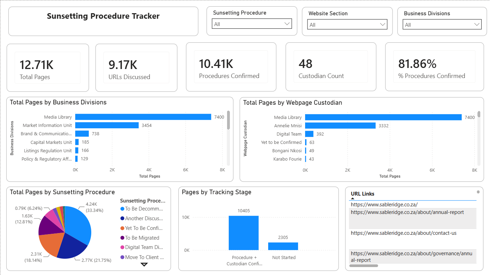
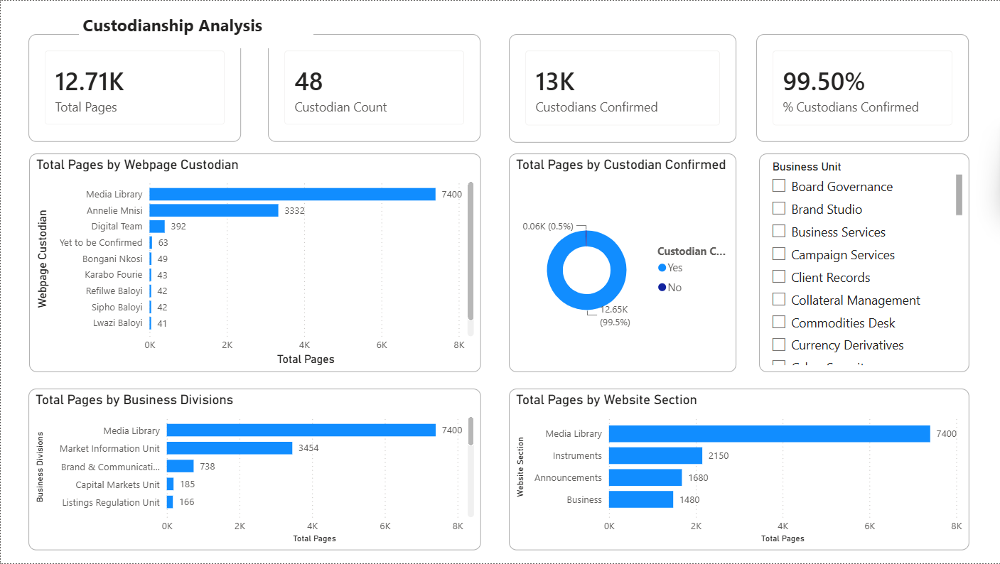

# Sunsetting Procedure Console

**A Power BI system built to support a stock exchange's move to a new content management system: it gives every page across a 12,710-address website backlog a custodian and a decision, and the audit's findings became the migration's business case, now in front of executives for approval.**

`Power BI` `DAX` `Power Query` `Microsoft Excel`

I built the system that assigns each page a custodian, the person who decides whether it stays or goes. Working with a digital team and stakeholders across the business, the audit went through the site page by page, sorted legacy content from what was still relevant, and routed each page to a decision: decommissioned, or migrated onto the new CMS. That work is part of a wider project to migrate the site onto a CMS designed to handle the organisation's scale, and the audit's findings built the business case for it, now before executives for approval.

Three linked Excel workbooks hold the ownership record, the decision record and the traffic figures. A validated intake form collects decisions from each business division. A two page Power BI report is built on all three workbooks and states how far the work has got and where responsibility is still missing.

## The Numbers

|        12,710        |           99.5%           |         6,582         |         4,237         |
| :-------------------: | :-----------------------: | :--------------------: | :-------------------: |
| Web addresses tracked | Under confirmed ownership | Given a final decision | Marked for retirement |

Every figure on this page is a property of the published dataset, which is synthetic. [About the Data](#about-the-data) explains what that means and what is real.

## Artifacts

| File                                                                    | What It Is                                                                                                                                                                                       |
| ----------------------------------------------------------------------- | ------------------------------------------------------------------------------------------------------------------------------------------------------------------------------------------------ |
| [**Data_Dictionary.pdf**](Data_Dictionary.pdf)                     | **Read this first.** The data dictionary — a 14-page reference defining every field in the data set, the values each one accepts, what each dashboard figure calculates, and the ten rules the data has to pass                                         |
| [Project_Brief.pdf](Project_Brief.pdf)                                   | 5 pages. What the programme covers, who is responsible for what, how a page gets assessed, and over what timescale                                                                               |
| [Webpage_Custodianship_Records.xlsx](Webpage_Custodianship_Records.xlsx) | The ownership record. 12,710 rows, 9 fields, on a sheet named`Webpage_Demographic`. One named person per web address, the division they work in, and whether they have accepted responsibility |
| [Sunsetting_Outcome_Records.xlsx](Sunsetting_Outcome_Records.xlsx)       | The decision record. 12,710 rows, 9 fields. One decision per web address chosen from a fixed list of ten, with a reason, a date and a written explanation                                        |
| [Custodian_Page_URLs_Template.xlsx](Custodian_Page_URLs_Template.xlsx)   | The form sent to a division. It lists their pages and gives them one column, restricted to`Keep`, `Consolidate` or `Sunset`                                                                |
| [Sunsetting_Console_Dashboard.pbix](Sunsetting_Console_Dashboard.pbix)   | The Power BI report behind both dashboard pages below. Opens in Power BI Desktop                                                                                                                 |

Nothing needs installing beyond Excel, and Power BI Desktop only to open the report file.

## What the Outputs Show

Two dashboard pages, both built on the same three workbooks.



**Page 1, Sunsetting Tracker.** The five figures across the top are the total number of web addresses (12,710), how many have had a discussion recorded against them (9,174), how many have a decision recorded (10,405), how many separate parties are accountable (48) and what share of addresses have a decision (81.86%). Below them are the number of addresses per division, the number per custodian, the split across the ten decisions as a pie chart, a two stage progress chart, and a scrollable list of individual addresses. The three controls at the top filter the whole page by decision, by website section or by division.



**Page 2, Custodianship Analysis.** Who is accountable, and where nobody is. The four figures across the top are the total (12,710), the number of accountable parties (48), how many addresses have an owner who has accepted responsibility (12,647) and what share that is (99.50%). Below them are the number of addresses per custodian, the accepted against not accepted split as a ring chart, the number per division, the number per website section, and a filter by business unit.

## Where the Data Comes From

A web address is not the same thing as a page. A content management system also hands out addresses for stored files such as documents and images, and on a website of any age those outnumber the actual pages. They need decisions too, so they are included, but they are recorded in their own website section called `Media Library` and are never counted as pages. That section alone holds 7,400 of the 12,710 addresses, 58.2%. Excluding it leaves 5,310 addresses.

Recorded discussion dates run from 12/08/2025 to 08/07/2026, covering 12,710 addresses in both the ownership and decision records (the same set, no duplicates in either) and 9,727 in the traffic file. Each record file carries 9 fields; the traffic file carries 5.

| Group                | Fields                                                                                                                                                                       |
| -------------------- | ---------------------------------------------------------------------------------------------------------------------------------------------------------------------------- |
| Identity             | `WCR_ID` and `SOR_ID`, the row references; `URL Links`, the web address, which is the only field the three files are joined on; `Description`, a readable page label |
| Ownership            | `Webpage Custodian`, `Custodian Confirmed`, `Business Unit`, `Business Divisions`                                                                                    |
| Position on the site | `Website Section`, `URL_Validation_Flag`                                                                                                                                 |
| The decision         | `Sunsetting Procedure`, `Reason`, `Date of Sunsetting Discussion`, `Comments`, `Page Created`                                                                      |
| Traffic              | `Page Views`, `Average Session Duration (s)`, `Bounce Rate`                                                                                                            |

The traffic file is smaller than the other two, and that gap is evidence rather than a data quality problem. A sitemap is the machine readable index a website publishes so that search engines and traffic measurement tools know which pages exist. An address absent from it can still be opened if you know it, but no measurement tool finds it, so it has no traffic row. 2,983 addresses have no traffic record: 2,641 flagged `NOT in Sitemap - Potential Sunset` and 342 published after traffic measurement ended. Reading a missing row as zero views would invert the finding, because for those addresses the absence of a row is itself the evidence.

This system does not clean a faulty export; it is the instrument that produces the data in the first place, so the design work went into preventing bad values from being entered rather than repairing them afterwards. `Sunsetting Procedure` and `Reason` are restricted at entry to the ten and five permitted values held on a separate `Lists` sheet inside the same workbook. The intake form restricts its `Decision` column to three values the same way. The two record files store their rows as named Excel tables, `tblWCR` and `tblSOR`, so a row added at the bottom is included in every total calculated from that table.

## How It Works

```
Custodian_Page_URLs_Template.xlsx          the form
  sheet Page_Review, 40 example rows         issued to a division about two weeks
  one Decision column, restricted to         before its meeting, returned page by page
  Keep / Consolidate / Sunset
        |
        v
  verification discussion                    held with the division, page by page
        |
        v
+-------------------------+-------------------------+
|                         |                         |
Webpage_Custodianship_    Sunsetting_Outcome_       URL_Performance_
Records.xlsx              Records.xlsx              Dataset.xlsx
who is responsible        what was decided,         how much traffic
for this address          why, and when             it gets
12,710 rows x 9 fields    12,710 rows x 9 fields    9,727 rows x 5 fields
sheet Webpage_Demographic sheet Sheet1              sheet Valid_URL_Performance
|                         |                         |
+-------------------------+-------------------------+
                          |
                joined on URL Links
                          |
                          v
          Sunsetting_Console_Dashboard.pbix
          Page 1  Sunsetting Tracker
          Page 2  Custodianship Analysis
```

The method runs in seven steps.

1. **Compile.** Every web address on the site is listed, labelled with the website section it belongs to, and grouped by the division responsible for it.
2. **Issue.** Each division receives its own list, the three assessment questions and a meeting invitation, about two weeks ahead. Two weeks is not arbitrary. A division cannot answer from memory. It has to check which services are still running and ask whoever requested the content originally.
3. **Review.** The division answers three questions for each of its pages, ordered from cheapest to hardest: can this content be merged into another page; who is it for and does an identifiable group of users rely on it; is it part of a service that is still running. A division that cannot answer the third question has effectively already answered it.
4. **Decide.** The division records `Keep`, `Consolidate` or `Sunset` against each address on the form.
5. **Verify.** The digital team and the division go through the returned form together, page by page. A returned form states what a division wants. The discussion establishes whether that division is even the right one to be asking, and it finds the pages two divisions both claim and the pages neither will take. A form on its own never finds those.
6. **Record.** Each divisional answer is converted into one of the ten decisions the tracker holds, and written to `Sunsetting_Outcome_Records.xlsx` with a reason and the date of the discussion. This is a conversion, not a copy, and it is listed as its own step so the judgement involved stays visible.
7. **Action.** Confirmed pages are unpublished or sent to the destination that was agreed.

The form offers three answers and the tracker records ten, and that mismatch is deliberate. A division is being asked what it wants to happen to its content, not to pick the correct internal procedure. Making the form match the tracker would have been easier to build and much harder to fill in.

## The Method in Full

### What Gets Recorded

Ten decisions are permitted in `Sunsetting Procedure`. Six are final, meaning the page can be acted on. Four are not, and those four are the point of the list rather than padding.

| Decision                            | Meaning                                              | Final | Count |
| ----------------------------------- | ---------------------------------------------------- | :---: | ----: |
| `To Be Decommissioned`            | Retired, not carried forward                         |  Yes  | 4,237 |
| `Another Discussion to be Held`   | Reviewed, decision put off to a later session        |  No  | 2,765 |
| `Yet To Be Confirmed`             | Starting state. Nobody has looked at it              |  No  | 2,305 |
| `To Be Migrated`                  | Active, carried across to the new software unchanged |  Yes  | 1,628 |
| `Digital Team Discretion`         | No division claims it, so the digital team decides   |  No  |   793 |
| `Move To Client Portal`           | Only relevant to logged in clients                   |  Yes  |   290 |
| `Move To Group Site`              | Corporate rather than operational content            |  Yes  |   275 |
| `Temporarily Unpublished`         | Withdrawn pending a decision, restorable             |  No  |   265 |
| `To Be Migrated (Content Update)` | Carried across, but rewritten first                  |  Yes  |   138 |
| `Move To Clearing House Site`     | Belongs on a separate related website                |  Yes  |    14 |

A simple confirmed against unconfirmed field would put "we discussed this and put it off", "no division claims it" and "nobody has looked at it yet" into one group. Those are three different problems needing three different responses: a follow up meeting, an escalation, and scheduling. The three `Move To` decisions exist for the same reason, because moving content somewhere else and deleting it are routinely treated as the same thing and they have opposite consequences.

`Reason` holds five permitted values and is filled in only where a decision needs justifying: `Page Info Irrelevant` (868 rows), `Very Low Page Views` (866), `No Use Case` (773), `Custodian Request Decommission` (770) and `No Reason / To Be Migrated` (1,679). That last one looks like an empty cell and deliberately is not one. It states that no justification is required here, which keeps a genuine blank meaning that a justification is missing.

`Webpage Custodian` holds 48 distinct values: 45 named individuals and 3 labels that are not people. `Media Library` marks stored files that no division authored, `Digital Team` marks site infrastructure or a page no division claims, and `Yet to be Confirmed` marks ownership that is genuinely unknown. Nobody is not an available answer, because a page with no owner and no marker is precisely the page that gets missed. 7,855 addresses are held by those three labels and 4,855 by named individuals.

### The Rules That Are Enforced

Ten rules hold across the three files. Every one of them passes on the published data.

| #  | Rule                                                                                                |
| -- | --------------------------------------------------------------------------------------------------- |
| 1  | `URL Links` appears once only within each of the three files                                      |
| 2  | The ownership record and the decision record contain an identical set of addresses                  |
| 3  | Every address in the traffic file exists in the ownership record. The reverse does not hold         |
| 4  | No traffic row exists for an address flagged`NOT in Sitemap - Potential Sunset`                   |
| 5  | `Custodian Confirmed` is `No` exactly when the custodian is `Yet to be Confirmed`             |
| 6  | An address whose custodian is`Yet to be Confirmed` must have the decision `Yet To Be Confirmed` |
| 7  | An address with the decision`Yet To Be Confirmed` has no reason and no discussion date            |
| 8  | `Reason` is empty for `Another Discussion to be Held` and `Digital Team Discretion`           |
| 9  | Every business unit belongs to exactly one division                                                 |
| 10 | Every value in a restricted column appears on that workbook's`Lists` sheet                        |

Rule 6 is the one that matters in use. It is the formal statement that a page nobody owns cannot be marked for deletion, and it is enforced in the data rather than left to good intentions. 63 addresses currently sit in that state.

### One Address Traced From Beginning to End

Row `WCR196` in the ownership record and row `SOR196` in the decision record are the same web address, `https://www.sableridge.co.za/learning/publications/webinars`.

| Where     | Field                             | Value                                                                                                                                       |
| --------- | --------------------------------- | ------------------------------------------------------------------------------------------------------------------------------------------- |
| Ownership | `Description`                   | Learning: Publications > Webinars                                                                                                           |
| Ownership | `Website Section`               | `Business`, so it counts as a page rather than a stored file                                                                              |
| Ownership | `URL_Validation_Flag`           | `In Sitemap`, so a traffic row is allowed to exist for it                                                                                 |
| Ownership | `Business Unit`                 | Brand Studio                                                                                                                                |
| Ownership | `Business Divisions`            | Brand & Communications, the division the form was sent to                                                                                   |
| Ownership | `Webpage Custodian`             | Annelie Mnisi                                                                                                                               |
| Ownership | `Custodian Confirmed`           | `Yes`, so rule 6 permits a real decision                                                                                                  |
| Traffic   | `Page Views`                    | 132                                                                                                                                         |
| Traffic   | `Average Session Duration (s)`  | 188.66                                                                                                                                      |
| Traffic   | `Bounce Rate`                   | 0.4031                                                                                                                                      |
| Decision  | `Date of Sunsetting Discussion` | 17/06/2026                                                                                                                                  |
| Decision  | `Sunsetting Procedure`          | `To Be Decommissioned`                                                                                                                    |
| Decision  | `Reason`                        | `Very Low Page Views`                                                                                                                     |
| Decision  | `Comments`                      | "This page relates to an event or campaign that has concluded. The content is out of date and no longer serves a current business purpose." |

Reading across: the division named an owner and she accepted, which is what rule 6 requires before any decision other than the starting one can be recorded. The page is in the sitemap, so its 132 views are measurable and `Very Low Page Views` can be evidenced rather than asserted. The written comment gives the reason the five permitted values cannot express, which is that the campaign behind the page has ended. Six months later, the questions "who agreed to this", "when" and "on what grounds" all have answers on one row.

### The Figures on the Dashboard

Seven figures and one calculated grouping.

| Figure                 | How it is calculated                                              |    Value |
| ---------------------- | ----------------------------------------------------------------- | -------: |
| Total Pages            | Number of rows in the ownership record                            |   12,710 |
| URLs Discussed         | Rows where`Date of Sunsetting Discussion` is not empty          |    9,174 |
| Procedures Confirmed   | Rows where`Sunsetting Procedure` is not `Yet To Be Confirmed` |   10,405 |
| % Procedures Confirmed | Procedures Confirmed divided by Total Pages                       |   81.86% |
| Custodian Count        | Number of distinct values in`Webpage Custodian`                 |       48 |
| Custodians Confirmed   | Rows where`Custodian Confirmed` is `Yes`                      |   12,647 |
| % Custodians Confirmed | Custodians Confirmed divided by Total Pages                       |   99.50% |
| Tracking Stage         | Groups the ten decisions into progress stages for the chart axis  | 2 stages |

Two of these are routinely misread. Custodian Count counts accountable parties including the three labels that are not people, so it is not a staff headcount. Custodians Confirmed counts addresses, not people, and it is placed next to Custodian Count on the page, so the two are routinely compared, which produces nothing meaningful.

## What the Tracker Reports

These are figures from the published dataset, which is synthetic. They demonstrate what the tracker measures rather than describing any real website.

**1.** Ownership came before decisions, in that order, and the figures show it: 99.5% of addresses (12,647 of 12,710) have an owner who has accepted responsibility, against only 51.8% of decisions marked final. Only 63 addresses remain unowned, and rule 6 holds every one of those at the starting decision. No decision can be recorded until somebody has accepted responsibility for the page, so ownership was always going to finish first.

**2.** 6,582 addresses have a final decision, just over half the backlog, and the remaining 6,128 are not one problem but four: 2,765 discussed and put off, 2,305 nobody has looked at yet, 793 that no division will claim, and 265 withdrawn pending a decision. Each needs a different response, a follow up meeting, scheduling, an escalation, or a review, so a single progress percentage would flatten four problems into one.

**3.** `Media Library`, not actual pages, is where most of the count sits: 7,400 of 12,710 addresses, 58.2% of the total. Quoting 12,710 as the size of the website overstates it by more than double, and that section also carries the highest retirement rate, 39.6% marked for decommissioning against 21.0% for `Business`.

**4.** Addresses missing from the sitemap retire at nearly twice the rate of addresses in it: 49.5% of the 2,641 flagged `NOT in Sitemap - Potential Sunset` are marked for decommissioning, against 29.1% of the 8,658 flagged `In Sitemap`. These are the same addresses with no traffic evidence at all, so 1,394 of the 4,237 retirement decisions rest on the division's judgement rather than a traffic figure.

**5.** One address, the home page, accounts for 1,600,000 of 4,757,296 recorded views, 33.6% of all traffic, and the ten busiest account for 65.9% between them. That concentration makes raw view counts useless as a ranking on their own: of the 9,727 addresses with any measurement, 4,077 received fewer than 10 views, 41.9%, and median views by section run from 86.5 for `Business` down to 8 for `Media Library`.

**6.** Two divisions hold 10,854 of 12,710 addresses between them, `Media Library` with 7,400 and Market Information Unit with 3,454, and a single named individual is custodian for 3,332 addresses on his own. The remaining fifteen divisions share what's left, 1,856 addresses.

## What to Do About It

The 2,305 addresses nobody has looked at need meetings scheduled. The 2,765 discussed and put off need a second session with the same division. The 793 nobody claims need escalating above divisional level, because the reason they have not moved is that no division will own them. The 265 withdrawn pending a decision need a date set for that decision. These are four separate jobs: working a single list from the top down treats four different problems as one queue.

Fix the **63 unowned addresses** before anything else. Rule 6 holds each of them at the starting decision, so no amount of divisional discussion moves them until somebody accepts responsibility. Small, defined, and completely blocking.

Don't extend the deadline for the addresses with no traffic evidence. The 2,983 addresses with no traffic record cannot be evidenced with page views, so they need a divisional answer or they will be carried across by default. They are also the addresses most likely to deserve retirement: 49.5% are already marked for it.

The `Media Library` figure needs reporting separately from the page figure, every time. At 58.2% of the total, it determines most of the value of any percentage calculated over the whole set, which is why both pages can be filtered by website section. A figure taken from an unfiltered card and one taken from a filtered card are not comparable.

Keep the ownership record after the migration goes through. The reduced set of pages is a one time result; the record of who answers for what is what stops the same question having to be answered from nothing next time.

## Limitations and Assumptions

- `Procedures Confirmed`, at 10,405, is actually higher than `URLs Discussed`, at 9,174, which is not what the names suggest: `Another Discussion to be Held` counts as a recorded decision, and 1,231 addresses carry a decision with no discussion date against them. Neither figure alone states how many pages are actually settled. The count of final decisions, 6,582, is the honest answer to that question.
- Ownership isn't enforced by the workbook that holds it. `Sunsetting_Outcome_Records.xlsx` and `Custodian_Page_URLs_Template.xlsx` restrict their decision columns at entry; `Webpage_Custodianship_Records.xlsx` has a `Lists` sheet holding its permitted values, but no restriction applied to the cells, so its consistency is checked after the fact rather than prevented at the point of typing.
- **`Page Created`** is defined in the schema and filled in for none of the 12,710 rows. How old a page is would be the most useful thing this model does not yet measure.
- Traffic here is a measurement window, not a lifetime total. It ranks addresses against each other within that window; it does not state how many people have ever visited a page.
- Three of the 48 values in `Webpage Custodian` are labels for content no individual owns, so the custodian count is not a headcount.
- `Webpage Custodian` appears in both record files rather than one, so each file can be read on its own in Excel, and the two copies can drift apart. The ownership record is the authoritative one.
- What each dashboard figure means is documented as a specification in `Data_Dictionary.pdf`, not reconstructed from the report file afterwards. The values it produces were checked against the three workbooks and match.

## Next Steps

- Fill in `Page Created` from the content management system, so page age can be used alongside traffic and ownership instead of standing in for them.
- **Separate the two progress figures properly:** add a count of final decisions to the dashboard next to the existing two, so discussed, recorded, and settled read as three distinct numbers.
- A reconciliation check between the two copies of `Webpage Custodian` is still missing. The rules already catch nine other classes of inconsistency; this would be the tenth.
- Apply the restriction lists to `Webpage_Custodianship_Records.xlsx`. The permitted values already sit on its `Lists` sheet, which closes the one remaining place a wrong value can still be typed.

## About the Data

**Every value in this repository is invented.** The addresses, page names, custodian names, business units, divisions, decisions, dates, comments and traffic figures are generated from a fixed starting number against a fictitious organisation called Sableridge Exchange, at `www.sableridge.co.za`. No real web address, person, division or decision appears anywhere in these files. Nothing here describes any real organisation's website, staff or decisions. The generating script is not published.

What is real is the system: the fields, the ten decisions, the five reasons, the three assessment questions, the ten integrity rules, the join between the three files, the dashboard calculations, the CMS diagnosis and business case, and the process that produces the records. That work was done for a stock exchange's digital team as part of a wider CMS migration project, and the published copy replaces the organisation and every value in it. The names of the three destinations behind the `Move To` decisions are generalised for the same reason. The routing itself is as it was designed.

Two properties of the invented data were preserved deliberately, because the system exists to handle them. Traffic is concentrated in the same way as on real websites, where a single page takes a large share of all views and most pages take almost none, because `Very Low Page Views` is only a usable reason when measured against a realistic spread. And the gap between the 12,710 addresses and the 9,727 traffic rows reproduces the real relationship between the sitemap and the measurement window.

Every figure quoted on this page was calculated from the four workbooks in this repository. The two screenshots were taken from the Power BI report built on those same workbooks.

## Author and Contact

**Ndivhuwo Makhavhu**, data analyst. Design, build and documentation.

- Email: [ndivhumakhavhu@gmail.com](mailto:ndivhumakhavhu@gmail.com)
- LinkedIn: [www.linkedin.com/in/ndivhuwo-makhavhu](https://www.linkedin.com/in/ndivhuwo-makhavhu)
- GitHub: [github.com/MainDevWork](https://github.com/MainDevWork)
- This project: [Sunsetting_Procedure_Console](https://github.com/MainDevWork/Sunsetting_Procedure_Console)

[**Back to the top**](#sunsetting-procedure-console)
